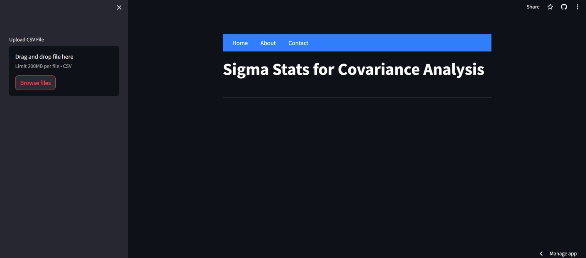
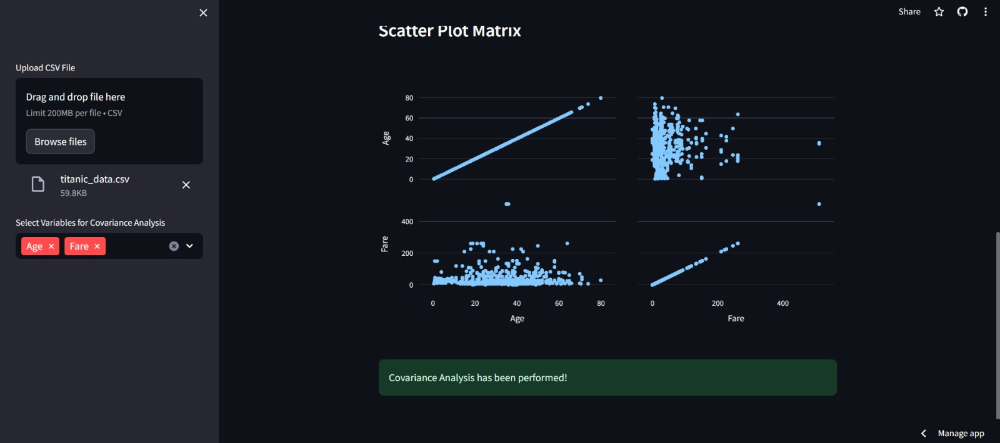

# Streamlit Web Application for Covariance Analysis

**Punchline:** Perform and visualize covariance analysis using an interactive Streamlit web application.

## Description

This project is a web application built with Streamlit that allows users to upload a CSV file and perform covariance analysis between selected variables. The application displays the covariance matrix and scatter plot matrix for the selected variables.

## Table of Contents

- [Installation](#installation)
- [Usage](#usage)
- [Demo](#demo)
- [Results](#results)
- [Contributing](#contributing)
- [License](#license)
- [Acknowledgements](#acknowledgements)

## Installation

To get this project up and running on your local machine, follow these steps:

1. Clone the repository:

    ```bash
    git clone https://github.com/muhammadwaleedyasin/Covariance-Web-App.git
    cd Covariance-Web-App
    ```

2. Create and activate a virtual environment (optional but recommended):

    ```bash
    python -m venv venv
    source venv/bin/activate  # On Windows use `venv\Scripts\activate`
    ```

3. Install the required packages:

    ```bash
    pip install -r requirements.txt
    ```

4. Run the Streamlit app:

    ```bash
    streamlit run corr.py
    ```

## Usage

1. Open your web browser and go to the URL provided by Streamlit (typically `http://localhost:8501`).
2. Upload a CSV file using the sidebar uploader.
3. Select more than one variable from the CSV file for covariance analysis.
4. Click the "Perform Covariance Analysis" button to see the results.

## Demo

Here are some screenshots of the application in action:




## Results

The application displays the covariance matrix for the selected variables and visualizes the data using a scatter plot matrix.

## Contributing

If you want to contribute to this project, follow these steps:

1. Fork the repository.
2. Create a new branch.
3. Make your changes.
4. Submit a pull request.

## License

This project is licensed under the MIT License - see the [LICENSE](LICENSE) file for details.

## Acknowledgements

- Thanks to the creators of Streamlit for their excellent web framework.
- Thanks to the developers who contributed to the libraries used in this project.
